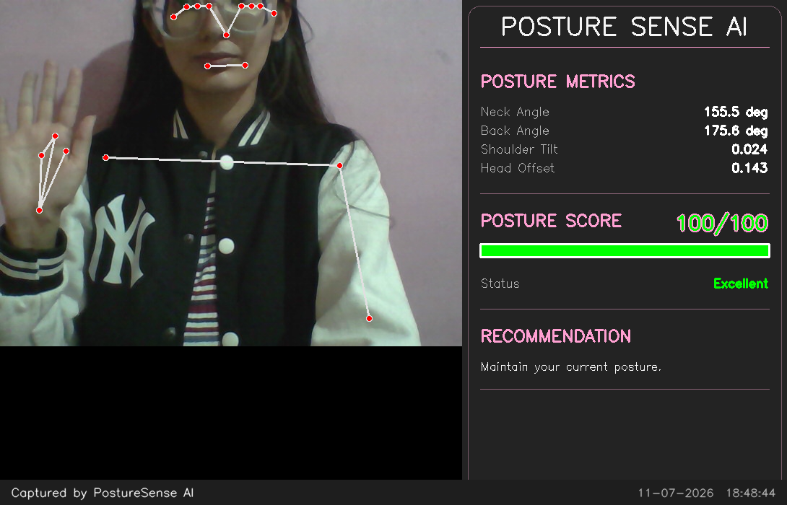
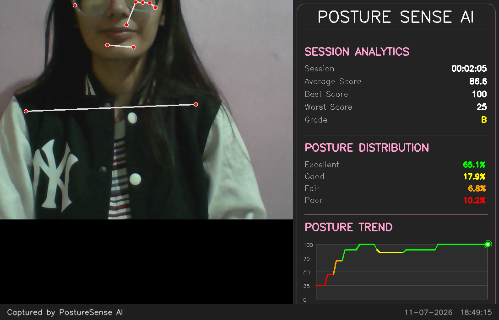
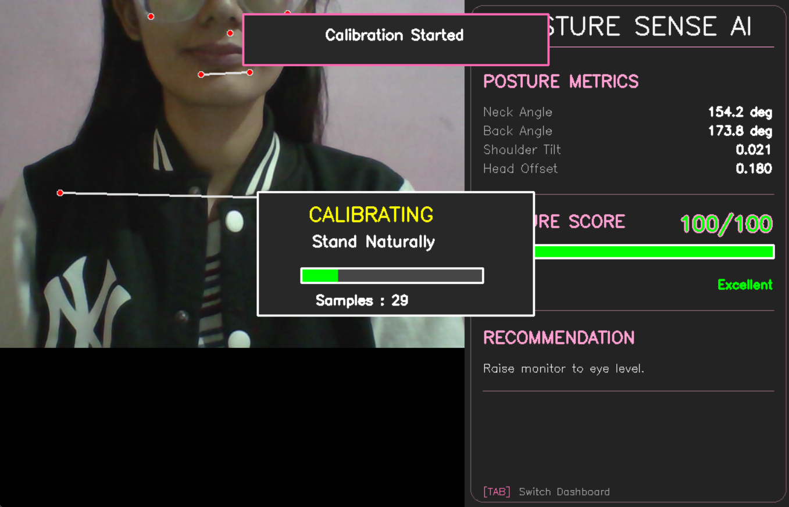
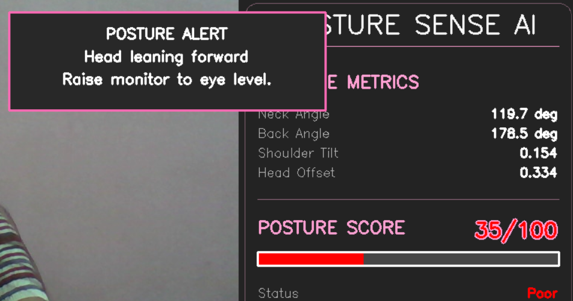
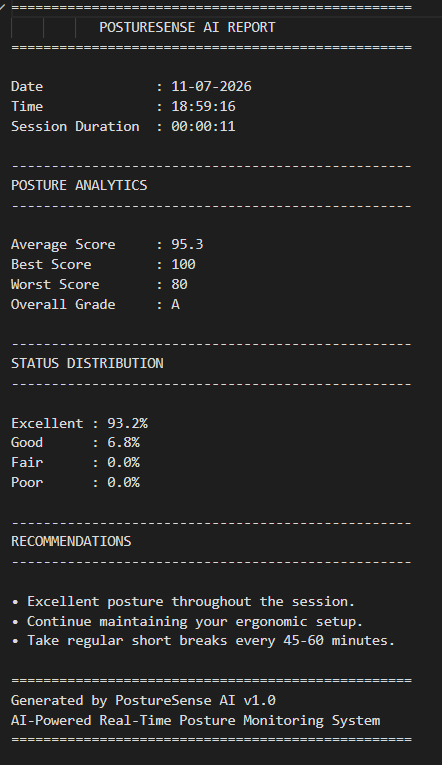

# 🧍 PostureSense 

<p align="center">
  <b>AI-Powered Real-Time Posture Monitoring & Analytics System</b><br>
  Monitor posture in real time, receive intelligent recommendations, visualize posture trends, and generate detailed session reports.
</p>

<p align="center">


</p>

<p align="center">
  
</p>

---

# 📖 Overview

**PostureSense** is a real-time posture monitoring application that uses **MediaPipe Pose** and **OpenCV** to analyze a user's sitting posture through a webcam.

The system extracts body landmarks, measures neck and back alignment, evaluates posture quality using a dynamic scoring algorithm, provides real-time posture recommendations, and generates comprehensive session analytics through an interactive dashboard.

The project demonstrates practical applications of **Computer Vision**, **Human Pose Estimation**, **Real-Time Analytics**, and **Software Engineering** principles in a health-focused desktop application.

---

# ✨ Features

## 🎥 Real-Time Monitoring
- Live webcam posture tracking
- Human pose estimation using MediaPipe
- Automatic body landmark detection
- Real-time posture score (0–100)

---

## 📐 Posture Analysis
- Neck angle detection
- Back angle estimation
- Shoulder tilt measurement
- Head offset calculation
- Personalized calibration system
- Feature smoothing for stable measurements

---

## 💡 Intelligent Recommendations
- Detects posture deviations in real time
- Provides corrective suggestions
- Real-time posture notifications for prolonged poor posture
- Color-coded warning system

---

## 📊 Analytics Dashboard
- Multi-page dashboard (TAB navigation)
- Session statistics
- Average posture score
- Best & worst score
- Overall session grade
- Posture distribution
- Live posture trend graph

---

## 📄 Session Management
- Automatic posture logging
- Session report generation
- Screenshot capture
- Watermarked screenshot capture
- Runtime analytics

---

# 📷 Screenshots

## Analytics Dashboard

> Visualizes overall session performance including posture distribution and trend graph.



---

## Calibration

> Personalized calibration establishes the user's neutral sitting posture before monitoring begins.



---

## Notification Popup

> Displays real-time posture alerts and corrective recommendations when prolonged poor posture is detected.



---

## Session Report

> Automatically generated report summarizing posture performance and recommendations.



---

# 🛠 Tech Stack

| Category | Technologies |
|-----------|--------------|
| Programming Language | Python |
| Computer Vision | OpenCV |
| Pose Estimation | MediaPipe |
| Numerical Computing | NumPy |
| Data Logging | CSV |
| Image Processing | Pillow |
| Visualization | OpenCV Drawing APIs |

---

# ⚙️ Project Architecture

```
Webcam
    │
    ▼
Pose Detection
(MediaPipe)
    │
    ▼
Feature Extraction
    │
    ▼
Calibration
    │
    ▼
Posture Analysis
    │
    ▼
Recommendation Engine
    │
    ▼
Analytics
    │
    ├──────────────┐
    ▼              ▼
Dashboard     Notifications
    │              │
    └──────┬───────┘
           ▼
 Session Reports
```

---

# 📂 Project Structure

```
PostureSense/
│
├── assets/
│   ├── live_dashboard.png
│   ├── analytics_dashboard.png
│   ├── calibration.png
│   ├── notification.png
│   └── report.png
│
├── data/
│
├── logs/
│
├── reports/
│
├── screenshots/
│
├── src/
│   ├── analytics.py
│   ├── calibration.py
│   ├── calibration_ui.py
│   ├── dashboard.py
│   ├── feature_extractor.py
│   ├── logger.py
│   ├── notification.py
│   ├── pose_detector.py
│   ├── posture_analyzer.py
│   ├── posture_monitor.py
│   ├── recommendation.py
│   ├── report_generator.py
│   ├── session_timer.py
│   ├── smoother.py
│   └── trend_graph.py
│
├── main.py
├── requirements.txt
└── README.md
```

---

# 🚀 Installation

Clone the repository

```bash
git clone https://github.com/TamannaBhatt/PostureSense.git
```

Move into the project

```bash
cd PostureSense
```

Install dependencies

```bash
pip install -r requirements.txt
```

Run the application

```bash
python main.py
```

---

# 🎮 Controls

| Key | Action |
|------|--------|
| **C** | Start Calibration |
| **TAB** | Switch Dashboard |
| **S** | Save Screenshot |
| **R** | Generate Session Report |
| **Q** | Quit Application |

---

# 📈 Future Improvements

- Multi-person posture monitoring
- Automatic break reminders
- Exercise recommendations
- Cloud-based analytics
- Mobile application support
- AI-powered posture prediction
- PDF report generation
- Voice alerts

---

# 📚 Skills Demonstrated

- Computer Vision
- Human Pose Estimation
- Real-Time Video Processing
- Software Architecture
- Object-Oriented Programming
- Modular Python Development
- User Interface Design

---

# 👩‍💻 Author

**Tamanna Bhatt**

GitHub: https://github.com/TamannaBhatt

---

## ⭐ If you found this project interesting, consider giving it a star!
